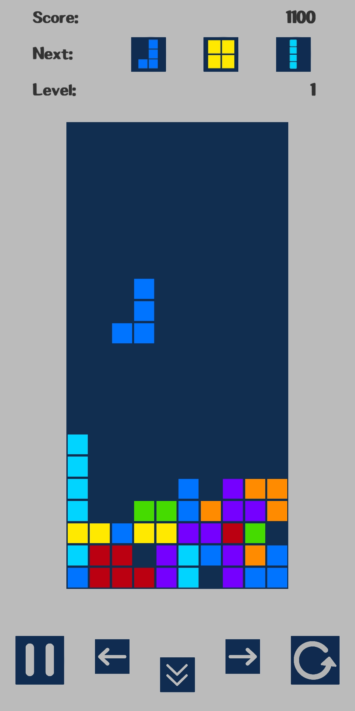

# Tetris
My implementation of a popular tile-matching video game Tetris.

## How to edit

Firstly install Unity3D (as well as Unity Hub, which you actually have to download first and from there you can choose which version of Unity you want). This project is developed under latest stable version of Unity at the time of the development (Unity 20.3.10f1 LTS).
Once installed add the project root folder (this one) via the Unity Hub and wait for it to install/download all prerequirements.

## Screenshot

## Release

- Download apk file from here: https://drive.google.com/file/d/12wtj5fIF4uYyX8-Jf8-sKljifUd_vaOh/view?usp=sharing (Android only)
  1) Enable installation of unkown apk files for your device (should be prompted during installation process (step 2))
  2) Run Tetris.apk file to start installation
  3) Play :)

## Music credits

- "The Lounge" from www.bensound.com (Royalty Free Music from Bensound)
- "Win City" from www.zapsplat.com

## Sound effects credits:

- All sound effects are generated using https://sfxr.me/

## Fonts

- Special thanks to HattyMikune (https://www.youtube.com/c/HattyMikune/) and ToxicDevil (https://www.youtube.com/user/ToxicDevil93) for letting me use their font
